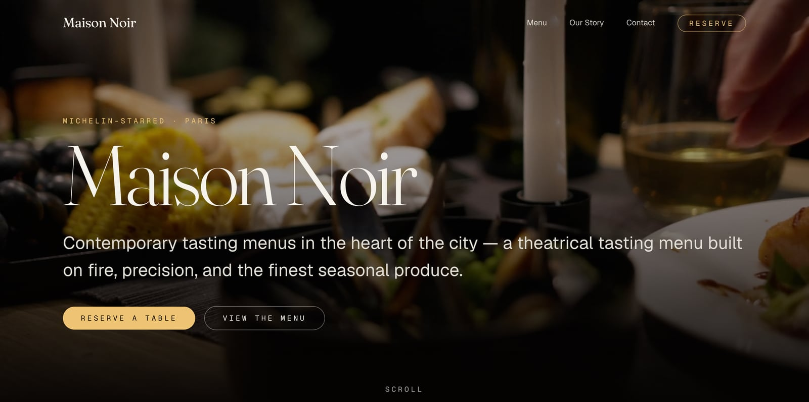
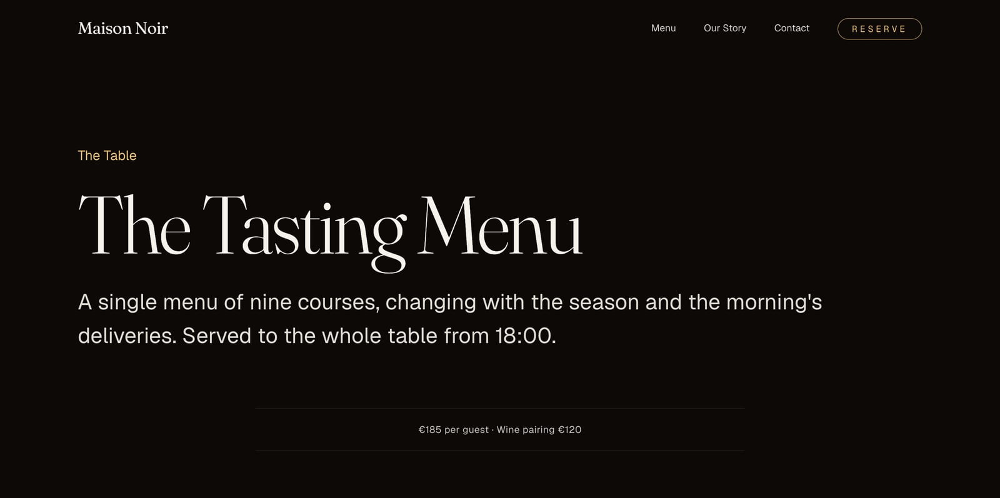
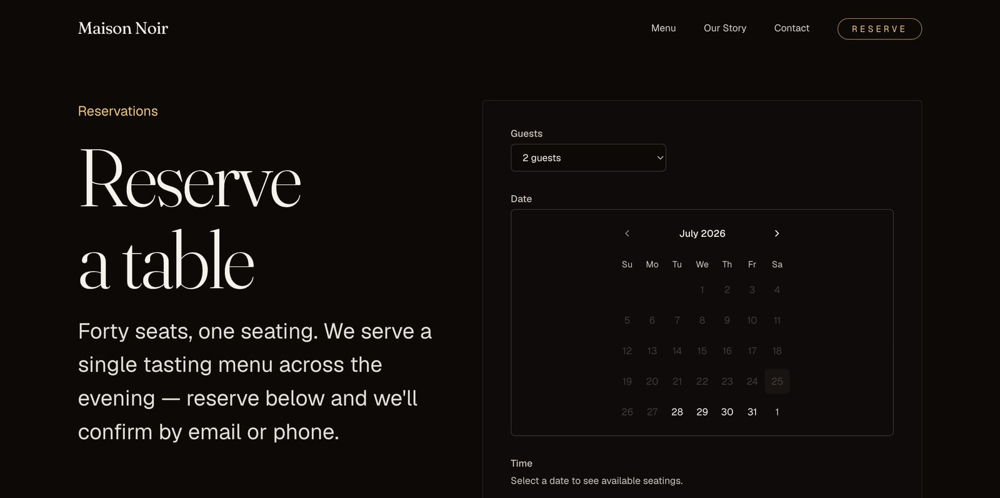

# Maison Noir

> **Contemporary tasting menus in the heart of the city.**
> A bold, cinematic website for a Michelin-starred restaurant — scroll-driven
> storytelling, a Sanity-managed menu & story, and a real custom reservation
> system with transactional email.

<p>
  <a href="https://github.com/ZakariaShahruri/maison-noir/actions/workflows/ci.yml"></a>
  
  
  
  
  
  
</p>

> [!NOTE]
> **This is a portfolio demo.** *Maison Noir* is a fictional restaurant; all
> content, imagery, and contact details are placeholders. The project exists to
> showcase a production-grade Next.js build, not to represent a real business.

**Live demo:** [maison-noir-rho.vercel.app](https://maison-noir-rho.vercel.app/)



<p>
  
  
</p>

## Highlights

- **Cinematic, scroll-driven home page** — a 7-beat storyboard where each section
  has its own motion personality (parallax, Ken Burns, clip-path wipes, kinetic
  type), built on Motion + Lenis smooth scroll.
- **Works with zero configuration** — clone, `npm run dev`, and the full site
  renders from bundled seed content. Forms run in a clearly-labelled demo mode
  until you connect services.
- **Real reservation system** — server-side availability per seating/capacity,
  shared Zod validation (client + server), type-safe persistence via Drizzle,
  and Resend confirmation + staff-notification emails.
- **Content-managed** — menu and story are editable in an embedded Sanity Studio
  at `/studio`, with a seed-content fallback when Sanity isn't connected.
- **Accessible & fast** — semantic HTML, keyboard-navigable menu and form
  controls, full `prefers-reduced-motion` support, connection-aware media, and
  SEO baked in (metadata, OG/Twitter images, sitemap, robots, `Restaurant`
  JSON-LD).

## Tech stack

- **Next.js 16** (App Router, React 19, Server Actions) · TypeScript (strict)
- **Tailwind CSS v4** + shadcn/ui (Base UI variant)
- **Motion** (Framer Motion) + **Lenis** smooth scroll — the cinematic home page
- **Sanity** — headless CMS for the menu & story (`/studio`)
- **Drizzle ORM** + **Postgres/Supabase** — reservations
- **Resend** + React Email — confirmation & staff notification emails
- Fonts: **Fraunces** (display) · **Geist** / **Geist Mono** (body / accents)

## Why these choices

- **Drizzle over Prisma** — a thin SQL-shaped query builder with no codegen step
  or bundled engine binary, so cold starts on serverless stay light. It also
  makes the raw SQL migration in `/drizzle` easy to read and audit by hand.
- **Sanity over a hardcoded CMS** — the menu and story need to be editable by
  someone non-technical without a redeploy, but the project also had to run
  with zero setup. Sanity's embedded Studio plus a seed-content fallback
  (`lib/content/defaults.ts`) gets both.
- **shadcn/ui over a component library** — the cinematic, bespoke look needed
  full control over markup and styling. shadcn copies primitives into the repo
  instead of installing an opinionated package, so nothing fights the design.
- **Motion + Lenis over CSS-only animation** — the home page's scroll-linked
  parallax and mask wipes need JS-driven, interruptible timelines that CSS
  can't express cleanly; Lenis smooths native scroll so those transforms read
  as deliberate rather than janky.
- **Resend + React Email over raw SMTP** — transactional email with templates
  you can preview and iterate on locally (`npm run email:dev`), instead of
  hand-building HTML strings against a mail server.

## Getting started

Requires **Node 24+** (see `.nvmrc`).

```bash
npm install
cp .env.example .env.local   # fill in as you connect services (all optional to start)
npm run dev
```

Open [http://localhost:3000](http://localhost:3000).

The site runs **fully without any credentials** — the menu and story fall back to
bundled seed content, and the reservation and contact forms work in a demo mode
(they validate and confirm in the UI, but don't persist or email until
configured, and say so clearly).

## Project structure

```
app/
  (site)/          # public site (nav + footer + smooth scroll chrome)
    page.tsx       # cinematic 7-beat home page
    menu, story, contact, reservations/
  studio/          # embedded Sanity Studio (no site chrome)
components/
  motion/          # SmoothScroll, Reveal, KineticText, Parallax, KenBurns, MaskWipe, ScrollScale
  sections/        # home-page storyboard beats
  reservations/    # BookingForm
  contact/         # ContactForm
  site/, ui/       # chrome + shadcn primitives
lib/
  sanity/          # client, image, queries (with seed fallback)
  db/              # drizzle schema + client
  reservations/    # config, availability, formatting
  email/           # Resend client + React Email templates
  content/         # normalized types + default seed content
```

## Connecting services

Each service is independent and optional — connect them in any order. Until you
do, the relevant feature falls back to demo behaviour.

### Site URL & social previews
Set `NEXT_PUBLIC_SITE_URL` to your canonical production URL — it drives
`metadataBase`, Open Graph, the sitemap, robots, and JSON-LD. The share images
are generated automatically at build time (`app/opengraph-image.tsx` and
`app/twitter-image.tsx`) — no asset to manage. Preview the Open Graph image at
`/opengraph-image`.

### Sanity (menu & story)
```bash
npx sanity@latest init   # create a project, choose the "production" dataset
```
Set `NEXT_PUBLIC_SANITY_PROJECT_ID` (and dataset). Then edit content at
`/studio`. Without these vars the site uses `lib/content/defaults.ts`.

### Database (reservations)
Provision Postgres (Supabase or Neon). Set `DATABASE_URL` (pooled) and
`DIRECT_URL` (direct), then run migrations:
```bash
npm run db:generate   # already generated in /drizzle
npm run db:migrate    # apply to your database
```
Staff view bookings via the Supabase/database dashboard (`reservations` table).
Tune seatings/capacity in `lib/reservations/config.ts`.

### Email (Resend)
Set `RESEND_API_KEY`, `RESERVATION_FROM_EMAIL` (verified sender), and
`RESTAURANT_NOTIFY_EMAIL`. This powers both the reservation confirmation /
staff-notification emails and the contact-form enquiries (sent to the notify
address, with the sender as reply-to). Preview templates with `npm run email:dev`.

## Accessibility & performance

Lighthouse, audited against the live production deployment (2026-07-25):

| | Performance | Accessibility | Best Practices | SEO |
|---|:---:|:---:|:---:|:---:|
| Desktop | 99 | 100 | 100 | 100 |
| Mobile | 92 | 100 | 100 | 100 |

- Every motion wrapper honours `prefers-reduced-motion` — animations fall back to
  static, and the hero shows a poster frame instead of the looping video.
- The hero video is **connection-aware**: phones, small screens, and metered or
  Data-Saver connections get the lightweight poster instead of the ~7 MB clip.
- Semantic landmarks, a skip-to-content link, and visible focus styles. The
  mobile menu is a focus-trapped dialog (open/Escape/Tab handling) and the time
  picker is an arrow-key radiogroup.
- Imagery served through `next/image` (AVIF/WebP, responsive `sizes`); large
  source photos can be recompressed with `npm run optimize:images`.
- The public pages prerender as static.

## Scripts

| Script | Purpose |
|---|---|
| `npm run dev` / `build` / `start` | Next.js dev / build / serve |
| `npm run typecheck` / `lint` | TypeScript / ESLint |
| `npm run test` / `test:watch` | Run the Vitest suite once / in watch mode |
| `npm run db:generate` / `db:migrate` / `db:push` / `db:studio` | Drizzle migrations & studio |
| `npm run email:dev` | Preview React Email templates |
| `npm run optimize:images` | Recompress large source photos in `public/images` |

## Deploy

Deploy on Vercel. Add the env vars above in the project settings. The home page,
menu, story, and contact prerender as static; reservation and contact submission
run as Server Actions.

## Demo notes & scope

- No guest authentication or self-service cancellation — staff manage bookings
  from the database dashboard, by design for a v1.
- Availability uses simple per-seating capacity, not table-level floor management.
- Built to run comfortably on the free tiers of Sanity, Supabase/Neon, and Resend.

---

Built by **Zakaria Shahruri** as a portfolio demo. Imagery and brand are fictional.
